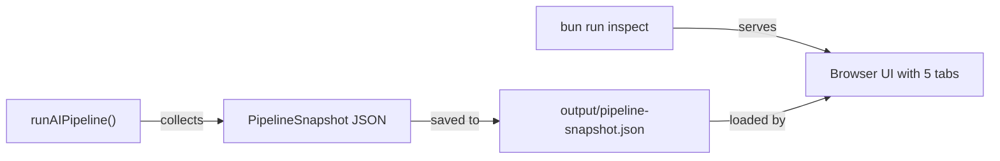

# Pipeline Inspector UI

## Approach

Capture a **snapshot** of each pipeline step's output, save it as JSON, and serve a lightweight tabbed HTML viewer via `Bun.serve`. No new dependencies required -- Bun's built-in HTTP server is sufficient.

## Data Flow



## Changes

### 1. Define `PipelineSnapshot` type

In [src/core/newsAnalyzer.ts](src/core/newsAnalyzer.ts), add a new interface:

```typescript
export interface PipelineSnapshot {
  timestamp: string;
  steps: {
    rssItems: RssItem[]; // raw input
    dedupedItems: RssItem[]; // after dedup
    embeddings: { item: string; vector: number[] }[]; // title + vector
    clusters: Array<{
      // raw clusters
      id: string;
      primary: { title: string; source: string; url?: string };
      related: Array<{ title: string; source: string; url?: string }>;
      memberCount: number;
    }>;
    scoredClusters: Array<{
      // after scoring/filtering
      id: string;
      primary: { title: string; source: string; url?: string };
      related: Array<{ title: string; source: string; url?: string }>;
      score: number;
      distinctSources: number;
      totalMentions: number;
    }>;
    summaries: ClusterSummary[]; // final summaries
  };
}
```

### 2. Modify `runAIPipeline` to collect snapshot

Inside the existing `runAIPipeline` method (~line 464), after each step, push data into a `snapshot` object. At the end, write:

```typescript
const snapshotPath = "output/pipeline-snapshot.json";
await Bun.write(snapshotPath, JSON.stringify(snapshot, null, 2));
logger.info(`[Pipeline] Snapshot saved to ${snapshotPath}`);
```

Key points:

- Embeddings are included for 2D projection on the client side
- No pipeline logic changes -- only reading existing variables
- Gated behind `config.runtime?.verbose` or a new `config.runtime?.inspect` flag to avoid overhead in production

### 3. Create inspector server

New file: `src/inspector/server.ts`

- Uses `Bun.serve` on port 3333 (or `INSPECT_PORT`)
- Routes:
  - `GET /` -- serves the HTML page
  - `GET /api/snapshot` -- returns the latest `output/pipeline-snapshot.json`
- ~40 lines of code

### 4. Create inspector HTML page

New file: `src/inspector/index.html`

A single self-contained HTML file (inline CSS + JS, no build step) with **5 tabs**:

| Tab                 | Content                                                                                          |
| ------------------- | ------------------------------------------------------------------------------------------------ |
| **Items**           | Table: title, summary, feed, publishedAt for all deduped items                                   |
| **Embeddings**      | 2D scatter plot via simple PCA (computed client-side), colored by feed. Stats: count, dimensions |
| **Clusters**        | Cards showing each cluster: primary article + related articles list, member count                |
| **Scored Clusters** | Same as Clusters but with score, distinctSources, totalMentions badges. Sorted by score          |
| **Summaries**       | Cards: headline, summary text, key points list, source links, importance score                   |

Styling: clean dark/light theme using CSS variables, responsive layout. PCA can be done in ~50 lines of vanilla JS for the 2-component case (power iteration on covariance matrix) -- no external library needed.

### 5. Wire up `package.json`

Add two scripts:

```json
"inspect": "bun src/inspector/server.ts",
"dev:inspect": "bun --watch src/inspector/server.ts"
```

### 6. Optional: `--inspect` flag for pipeline

Add `runtime.inspect: true` to `config/config.yaml` schema ([src/core/configSchema.ts](src/core/configSchema.ts)) so snapshot collection can be toggled independently of verbose mode.

## File Summary

| File                       | Action                                                                  |
| -------------------------- | ----------------------------------------------------------------------- |
| `src/core/newsAnalyzer.ts` | Add `PipelineSnapshot` type, collect + save snapshot in `runAIPipeline` |
| `src/inspector/server.ts`  | New -- Bun.serve HTTP server (~40 lines)                                |
| `src/inspector/index.html` | New -- single-file SPA with 5 tabs + inline PCA                         |
| `package.json`             | Add `inspect` and `dev:inspect` scripts                                 |
| `src/core/configSchema.ts` | Optional: add `runtime.inspect` boolean                                 |
