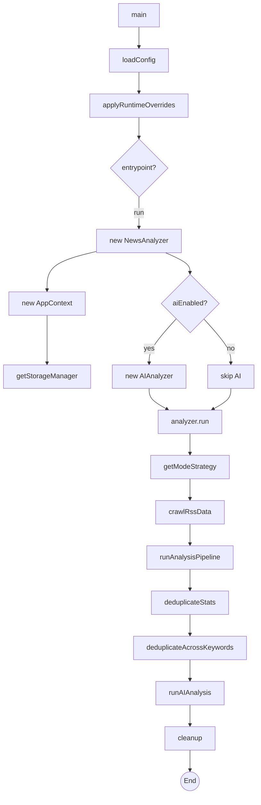
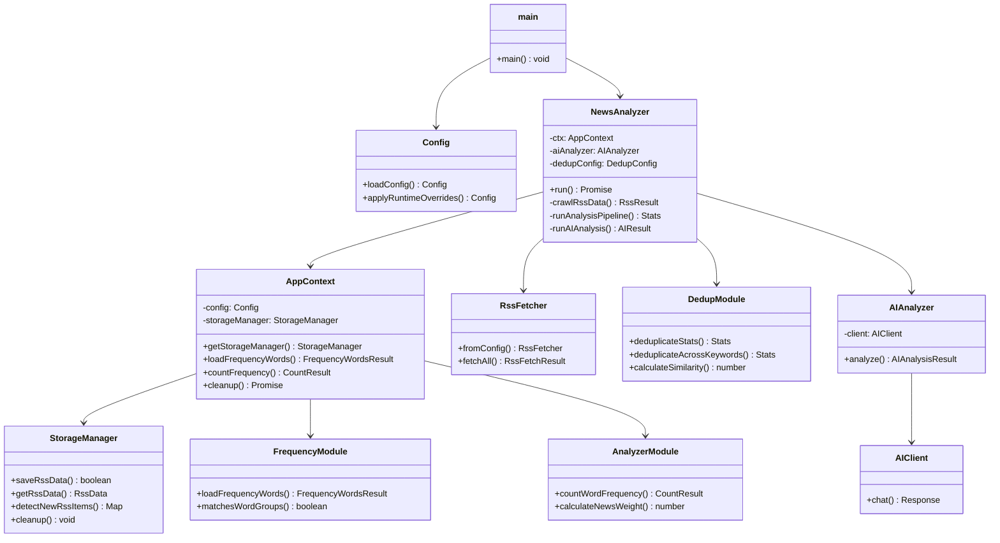
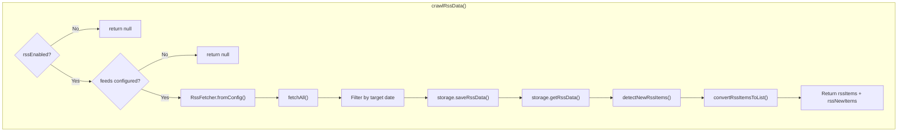
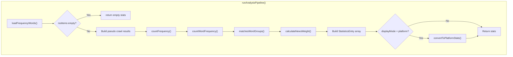
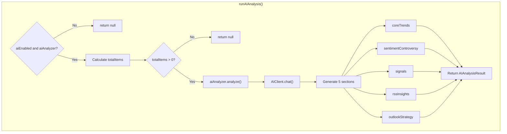

# TrendRadar Application Flow Diagram (`app.entrypoint = 'run'`)

This document provides comprehensive Mermaid diagrams showing how the TrendRadar application works when running in `run` mode.

## 1. High-Level Flow Diagram

## 2. Detailed Execution Flow

```mermaid
flowchart TD
    START((Start)) --> loadConfig["loadConfig()"]
    loadConfig --> applyOverrides["applyRuntimeOverrides()"]
    applyOverrides --> createAnalyzer["new NewsAnalyzer(config)"]
    
    createAnalyzer --> createContext["new AppContext(config)"]
    createContext --> initStorage["getStorageManager()"]
    initStorage --> selectBackend{storage.backend}
    selectBackend -->|local| sqlite["LocalStorageBackend"]
    selectBackend -->|remote| s3["RemoteStorageBackend"]
    selectBackend -->|auto| autoDetect["resolveBackendType()"]
    
    sqlite --> storageReady[Storage Ready]
    s3 --> storageReady
    autoDetect --> storageReady
    
    createAnalyzer --> checkAI{aiAnalysis.enabled?}
    checkAI -->|Yes| createAI["new AIAnalyzer()"]
    checkAI -->|No| skipAI[AI disabled]
    
    createAI --> configDedup["Configure dedupConfig"]
    skipAI --> configDedup
    storageReady --> configDedup
    
    configDedup --> runMethod["run()"]
    runMethod --> getTime["ctx.getTime()"]
    getTime --> getMode["getModeStrategy()"]
    getMode --> checkNotif["hasNotificationConfigured()"]
    checkNotif --> crawl["crawlRssData()"]
    
    crawl --> checkRss{rssEnabled?}
    checkRss -->|No| returnNull[Skip RSS]
    checkRss -->|Yes| createFetcher["RssFetcher.fromConfig()"]
    createFetcher --> fetchAll["fetcher.fetchAll()"]
    fetchAll --> filterDate["Filter by target date"]
    filterDate --> saveRss["storage.saveRssData()"]
    saveRss --> detectNew["storage.detectNewRssItems()"]
    detectNew --> convertList["convertRssItemsToList()"]
    
    returnNull --> analysis
    convertList --> analysis["runAnalysisPipeline()"]
    
    analysis --> loadFreq["ctx.loadFrequencyWords()"]
    loadFreq --> buildPseudo["Build pseudo crawl results"]
    buildPseudo --> countFreq["ctx.countFrequency()"]
    countFreq --> countImpl["countWordFrequency()"]
    countImpl --> matchGroups["matchesWordGroups()"]
    matchGroups --> calcWeight["calculateNewsWeight()"]
    calcWeight --> buildStats["Build StatisticsEntry[]"]
    buildStats --> checkDisplay{displayMode?}
    checkDisplay -->|platform| convertPlatform["convertToPlatformStats()"]
    checkDisplay -->|keyword| returnStats[Return stats]
    
    convertPlatform --> dedup
    returnStats --> dedup["Deduplication"]
    
    dedup --> dedupWithin["deduplicateStats()"]
    dedupWithin --> calcSimilarity["calculateSimilarity()"]
    calcSimilarity --> dedupAcross["deduplicateAcrossKeywords()"]
    
    dedupAcross --> checkAIEnabled{aiEnabled?}
    checkAIEnabled -->|No| skipAnalysis[Skip AI]
    checkAIEnabled -->|Yes| checkContent{content exists?}
    checkContent -->|No| skipAnalysis
    checkContent -->|Yes| analyze["aiAnalyzer.analyze()"]
    analyze --> aiClient["AIClient.chat()"]
    aiClient --> generateSections["Generate 5 sections"]
    
    skipAnalysis --> ctxCleanup["ctx.cleanup()"]
    generateSections --> ctxCleanup
    ctxCleanup --> closeStorage["Close storage connections"]
    closeStorage --> END((End))
```

## 3. Class Relationships

## 7. crawlRssData Detail

## 8. runAnalysisPipeline Detail

## 9. Deduplication Detail

```mermaid
flowchart TD
    subgraph Dedup["Deduplication Process"]
        D1[Input: StatisticsEntry array] --> D2["deduplicateStats()"]
        D2 --> D3[For each keyword group]
        D3 --> D4["normalizeTitle()"]
        D4 --> D5["calculateSimilarity() - Trigram Jaccard"]
        D5 --> D6[Group similar titles]
        D6 --> D7[Keep highest scored title]
        D7 --> D8["deduplicateAcrossKeywords()"]
        D8 --> D9[Remove duplicates across groups]
        D9 --> D10[Keep in highest priority group]
        D10 --> D11[Return deduplicated stats]
    end
```

## 10. AI Analysis Detail

## Key File Locations

| Component | File Path | Key Functions/Classes |
|-----------|-----------|----------------------|
| Entry Point | `src/index.ts` | `main()` |
| Config | `src/core/config.ts` | `loadConfig()`, `applyRuntimeOverrides()` |
| NewsAnalyzer | `src/core/newsAnalyzer.ts` | `NewsAnalyzer` class, `run()` |
| AppContext | `src/core/context.ts` | `AppContext` class |
| Frequency | `src/core/frequency.ts` | `loadFrequencyWords()`, `matchesWordGroups()` |
| Analyzer | `src/core/analyzer.ts` | `countWordFrequency()`, `calculateNewsWeight()` |
| Dedup | `src/core/dedup.ts` | `deduplicateStats()`, `deduplicateAcrossKeywords()` |
| RSS Fetcher | `src/crawler/rss/fetcher.ts` | `RssFetcher` class, `fetchAll()` |
| Storage Manager | `src/storage/manager.ts` | `StorageManager`, `getStorageManager()` |
| Local Storage | `src/storage/local.ts` | `LocalStorageBackend` |
| AI Analyzer | `src/ai/analyzer.ts` | `AIAnalyzer` class, `analyze()` |
| AI Client | `src/ai/client.ts` | `AIClient` class |

## Execution Summary

1. **Startup**: `main()` loads config, applies runtime overrides
2. **Initialization**: `NewsAnalyzer` creates `AppContext`, initializes storage and AI
3. **RSS Crawl**: Fetches all RSS feeds, filters by date, saves to storage, detects new items
4. **Analysis**: Loads keywords, matches titles against groups, calculates weights, builds stats
5. **Deduplication**: Removes similar titles within groups, then across groups
6. **AI Analysis**: (Optional) Generates 5-section analysis using configured AI model
7. **Cleanup**: Closes storage connections, cleans old data per retention policy
